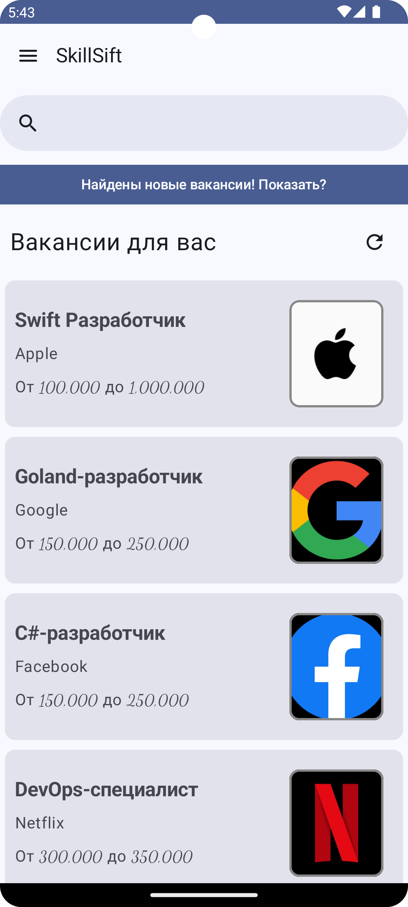
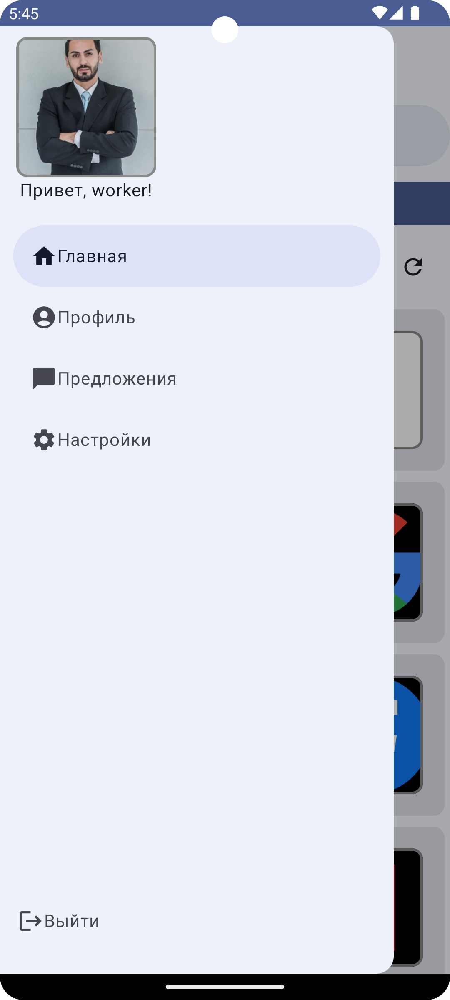

# Клиентская часть мобильного приложения для поиска вакансий

Данный проект - разработанное с использованием Jetpack Compose мобильное приложение, использующее API [job-search-platform.ru](https://job-search-platform.ru)

Функционал приложения включает в себя создание аккаунта в качестве работодателя или соискателя, создание вакансий/резюме, получение рекомендаций, поиск по существующим публикациям, отправку откликов/офферов и редактирование профиля. Примеры работы программы показаны ниже

|            Главная страница             |                  Навигационная панель                   |
|:---------------------------------------:|:-------------------------------------------------------:|
|  |  |